# 
# 概述

TI开发环境的软件和stm32的布局规则有差异

首先要确定的一点就是，cubemx是选择引脚确定功能，而css是确定好引脚功能和参数配置之后绑定引脚，这么做是出于硬件性能的充分利用的考虑

# GPIO配置

## 引脚组配置
添加一个ADD，第一个ADD是增加一个组，同组的意思就是同功能用途的引脚，可以采用相同的命名格式
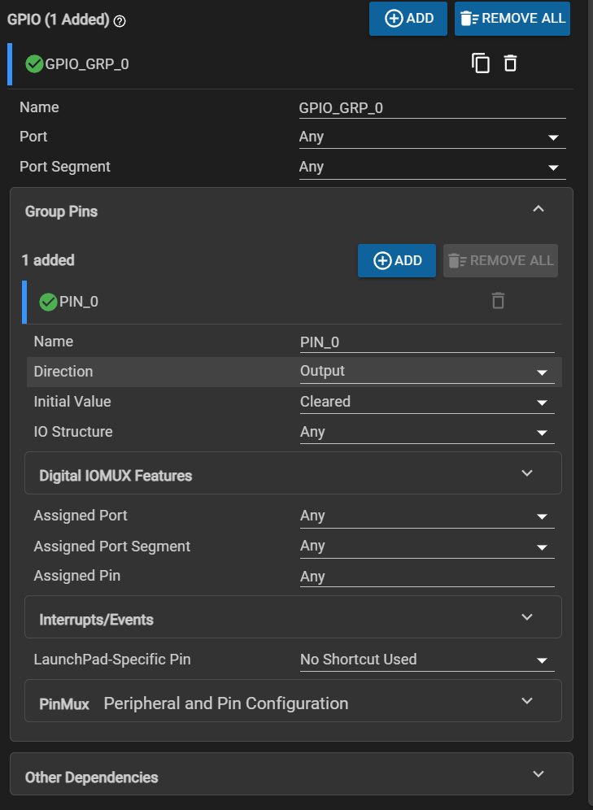

    name：首先就是引脚组命名

    port：其次是物理引脚组的选择。3507上就是两个物理端口GPIOA、GPIOB

    port segment：第三个是端口段，用来选择引脚段，芯片采用的是32位寄存器，高低端分别占16个引脚标号，

**要注意“引脚组”和“引脚”这两个名词概念的区分**
---

    （这里和下面的三个配置其实是有一点重复的，为什么重复，是因为这里是引脚组，这个地方确定的是引脚组下的所有的引脚的参数，当我们这这个位置选好物理端口GPIOA后面就没法选择GPIOB,因为引脚组的范围决定了该组下面的引脚的选择，如果我们这个位置选择的Any，那么下面的引脚的配置中就可以自由选择GPIOA、GPIOB）
    

## 引脚的参数配置

添加好引脚组之后，就是添加引脚组内引脚的数量和引脚的命名

命名之后就是对引脚的参数进行配置

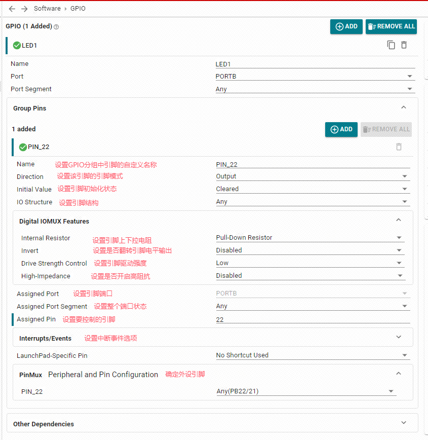

参数说明：
    Direcation：输出（output）或（输入）模式

    initial value: 初始值，只有在输出模式才需要配置，cleared是低电平，set是高电平

    IO Structure：设置IO结构。有多个选项，默认(Any)、标准(Standard)、唤醒(Standard with Wake)、高速(High-Speed)以及可以容忍5V(5V Tolerant Open Drain)的结构。

    不同引脚结构支持不同的功能，要根据需求选择对应的引脚结构
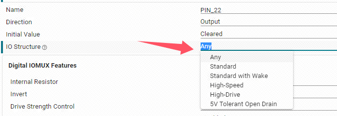

-- 
 **Digital IOMUX Features**

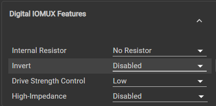

Internal Resistor：内部上拉下拉电阻，内部上下拉。比如说按键按下低电平的时候，我们设置为上拉也就是高电平，这样就能监测到按键按下。

inert：电平翻转。输入的电平信号翻转一下再被接收到，对输出的电平没有影响

Drive strength control：引脚的驱动强度。通过内部晶体管通道开启的多少来控制电压升降的速度，驱动强度越高电流越大电压建立越快，电压变化越陡峭。

High-impedance：高阻抗。类似于开漏输出，只能输出电平，输出高电平时候完全由外部电路控制。配制成输出模式的时候没有这个选项

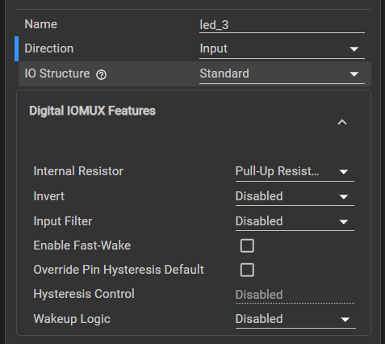

这是输出模式时候的Digital IOMUX Features配置页面

Enable Fast-Wake：快速唤醒的选项，低功耗状态之下快速启动，唤醒后立即响应外部中断。

Override Pin Hysteresis Default：引脚迟滞，相当于一个滤波，过滤掉一些短时间的电平变化，只保留稳定后的电平。可以一定程度上辅助按键去抖。

Hysteresis Control：迟滞的主开关。

Wakeup Logic ：唤醒逻辑

**上面的功能不是所有引脚都有的，需要去手册查看引脚是否支持**

这个是引脚的选择，就是上面说的配置有点重复的地方，其实不配置都没关系我觉得，因为最下面还有一个PinMux的配置，这个配置是直接选择引脚并锁定的，这里直接一步到位就行了。

## 中断触发

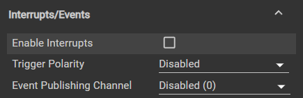

开启中断触发需要先勾选开启
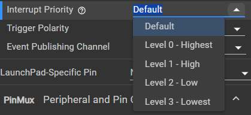

然后选择中断触发的优先级

Interrupt Priority：抢占优先级（M0是没有响应优先级的只有四个不同等级的抢占优先级）

Trigger Polarity：触发极性。选择触发的电平，是上升沿还是下降沿。默认是上升沿。

Event Publishing Channel：事件发布通道。触发外设联动（这个相当有趣，就是通过物理线路直接将中断触发信号作为发布者发布出去，然后别的一些外设可以订阅这个事件，当这个事件发生的时候，这些外设就会被触发节约了cpu资源）

这个是输出模式下的配置。输出模式下才能作为订阅者（详细操作再研究一下可以）

这个就是选择引脚并锁定

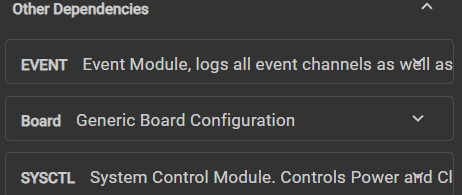
一般不需要我们手动配置

## 保存编译和调试

配置好引脚之后ctrl+s保存，然后编译一下

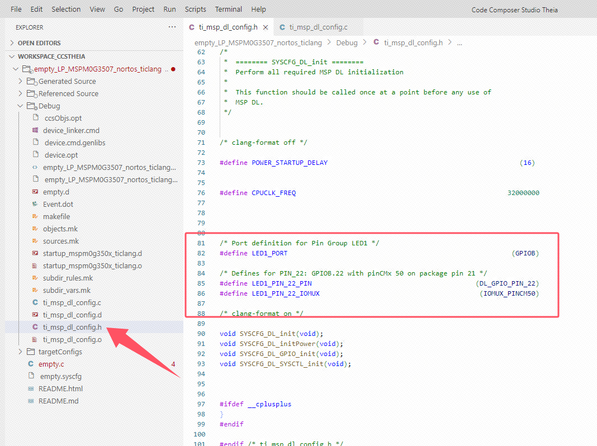

看到目录下面编译后的文件

调试就不在这里说了，关于调试也是很大一部分内容，这里就不展开了。

## 编程接口

GPIO配置好之后，如果想要控制IO引脚的电平，需要在代码中使用GPIO库函数。

在dl_gpio.h库函数文件中，提供三个函数可以控制引脚状态。

__STATIC_INLINE void DL_GPIO_setPins(GPIO_Regs* gpio, uint32_t pins)

__STATIC_INLINE void DL_GPIO_clearPins(GPIO_Regs* gpio, uint32_t pins)

__STATIC_INLINE void DL_GPIO_togglePins(GPIO_Regs* gpio, uint32_t pins)

比如说：引脚组命名为LED1_PORT，引脚命名为PIN_14,

该函数为控制引脚输出高电平

DL_GPIO_setPins(LED1_PORT,LED1_PIN_14_PIN);

该函数为控制引脚输出低电平

DL_GPIO_clearPins(LED1_PORT,LED1_PIN_14_PIN);

该函数为控制引脚的电平翻转

DL_GPIO_togglePins(LED1_PORT,LED1_PIN_22_PIN);

# 时钟配置

CCS里面这些时钟树里面的英文简称我都看不明白，和cubemx差异还挺大的
到那时院里还是一样的，不断得分分分，然后每一个部分都得到一个工作的时钟

## 时钟源的选择

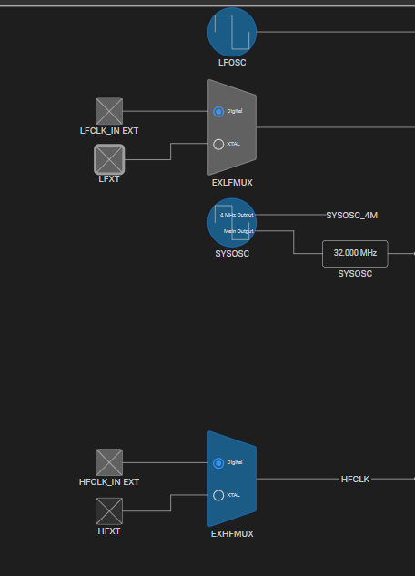

该图就是我们单片机常说的四个时钟源，内部高速内部低速，外部高速外部低速

FX是振荡器的意思

拿低速外部时钟来举例:

其实图里面可以看到时钟信号有4个，但是信号来源有6个，其中外部信号每个可以选择两种信号源：LFCLK_IN_EXT和LFXT，两者的区别是LFXT（Low-Frequency Crystal Oscillator）意思是定频晶振；LFCLK_IN_EXT（Low-Frequency Clock Input External）低频时钟信号输入。

晶振的话需要连两个脚，但是时钟信号的话只需要一个进入的引脚就行了，其他不用管，他们都是输出一定频率的方波信号就是了。

时钟源信号的配置直接点击对应的方框，用来选择引脚和一些关于时钟源的配置

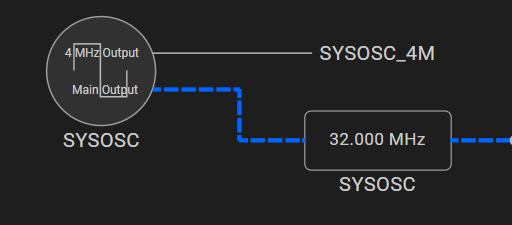
SYSOSC_4M是内部高速时钟通过特殊通道分出去的4MHz时钟信号

## 时钟输出

根据时钟信号的终端网上回推，就能选择对应的时钟信号的路线

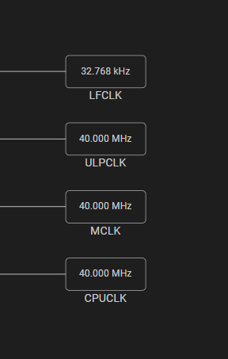

LFCLK:低速时钟输出

ULPCLK:低功耗时钟输出

MCLK:主时钟输出

CPUCLK:CPU时钟输出

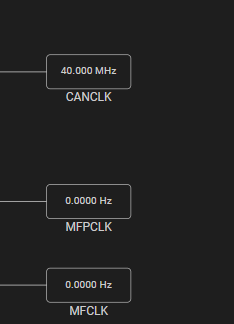

CANCLK:CAN时钟信号

MFPCLK（Multi-Function Pin CLK）:多功能时钟输出，输出给外部给外部器件使用

MFCLK（）Multi-Function CLK:多功能时钟信号，内部使用

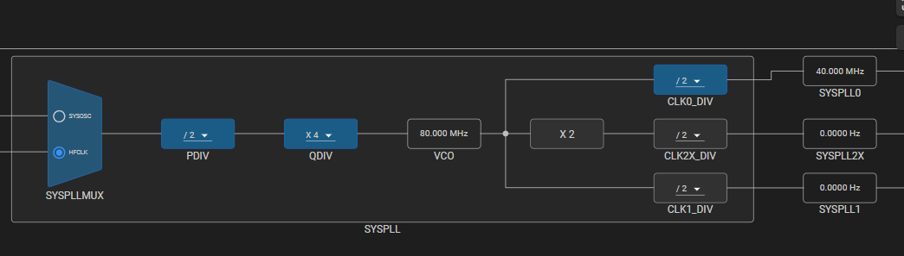

这些就是一些预分频器、锁相环之类的时钟信号，用来生成不同的时钟频率。

# 系统延时

初始化之后需要一点时间来稳定，所以需要在初始化完成之后再使用延时函数。

或者说某些情况就是需要去延时一段时间，比如等待外部器件初始化完成。就需要一个函数来延时一段时间。

## 阻塞延时

**delay_cycle(uint32_t cycles);**

这是官方提供的延时函数，实质就是执行一个空指令，用来延时一定的时间。延时一个周期的时间是1个时钟周期。

比如说现在主频，也就是CPUCLK频率为4MHz，那么延时1个周期的时间就是1/4MHz=250ns。
如果想要延时1ms，需要延时4000个周期。也就是delay_cycle(4000);

## 系统滴答定时器SYSTick

查手册发现，SYSTick定时器是一个24位，递减计数器

systick怎么配置：

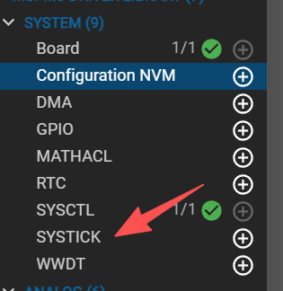

配置主界面的systeam我们可以找到systick的配置选项

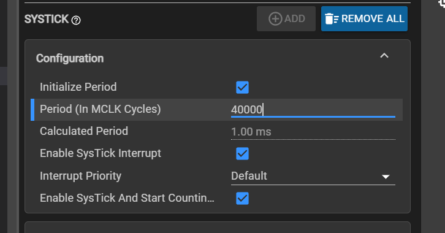

add之后可以配置systick的周期（根据MCLK频率计算），计算结果会在第二行灰色表示出来

Enable SysTick Interrupt 使能systick的中断，systick的中断会在systick的周期到0的时候触发。

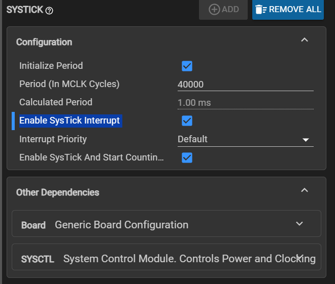

Enable SysTick And Start Counting 使能systick的计数，systick的计数会在systick的周期到0的时候触发。

Enable SysTick Interrupt :设置中断，计数结束之后触发中断

## 非阻塞延时函数

如果开启了systick的中断，然后去中断服务函数里面书写中断程序
。也可以依托这个中断写一个非阻塞延时函数。

系统滴答定时器的中断服务函数（中断标志位自行清除）：

**sysystick_handler(void);**

void SysTick_Handler(void)
{
    
    // 例如：获取编码器数值并且计算电机转速
}

# 中断&事件

# 定时器配置

# ADC&DAC

# DMA

# 通信

## 串口

## I2C

## SPI

## CAN  

# 