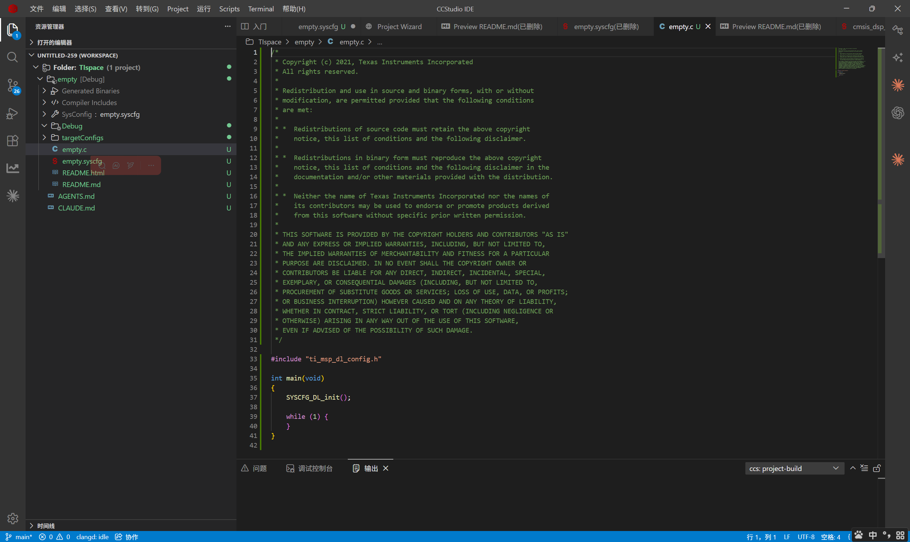
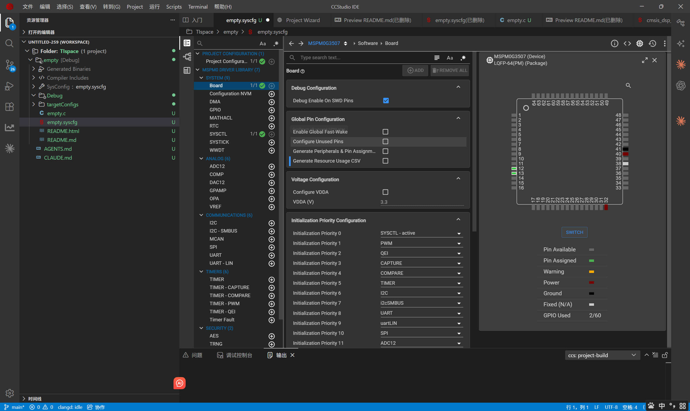
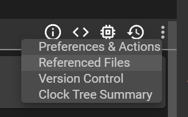
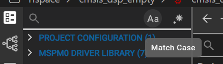
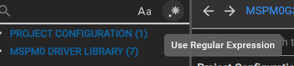
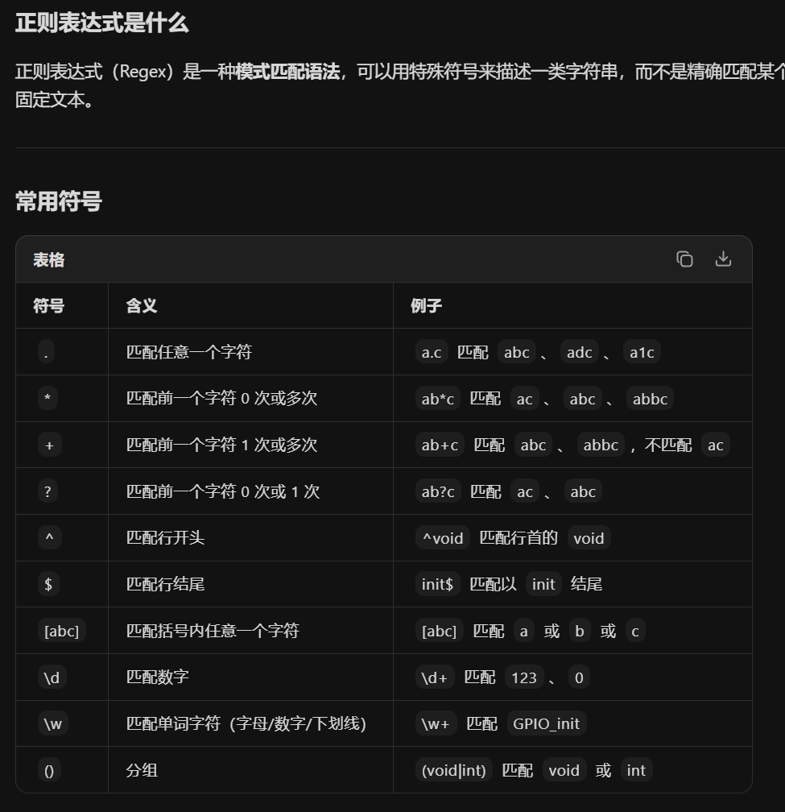
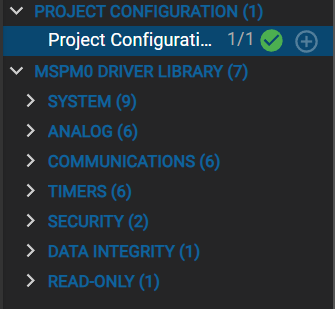
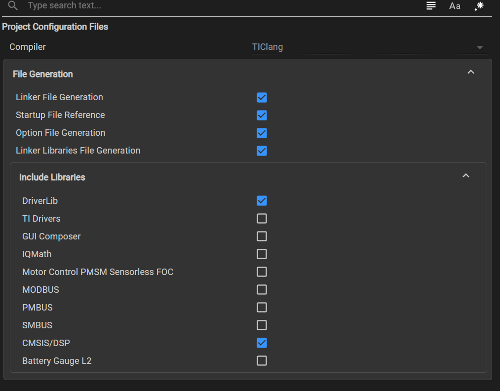
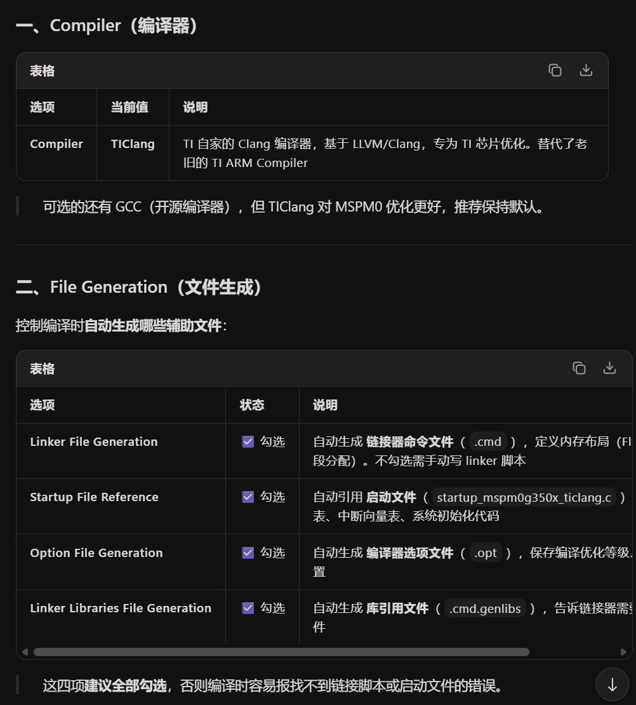
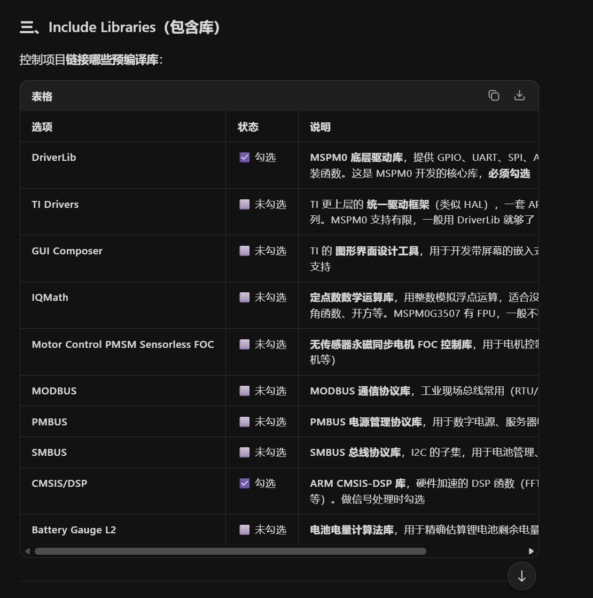

# 程序书写

通过空历程创建好项目之后，项目文件格式就如图所示。能见文件很少，大部分配置和链接的脚本都隐藏掉了

 empty.c就是我们程序书写的主文件，和那个stm32cubemx生成好代码之后其实差不多，自由度更高

 empty.confrg文件就是图形化配置界面的文件，双击打开，在里面初始化配置芯片

## 芯片的图形化初始化配置

* 图形化配置界面布局：
因为导入的是空历程，其实帮我们配置好了一些基本引脚，比如说烧录引脚已经帮我们打开了

从图中可以看到配置界面分为左中右三个部分
左侧是功能配置区域
中间是配置详情界面
右侧是芯片引脚配置图形化详情、日志、引脚功能报错、生成文件选项等的显示区域，显示哪一个是通过这几个按钮选择显示哪一个详情

### 功能配置区域详解

#### 功能配置搜索区域
如图即为功能搜索区域， Aa 图标表示搜索是是否区分大小写，
该图表示是否使用正则表达式搜索
什么是正则表达式搜索

#### 配置界面

* PROJECT CONFIGURATION :项目配置（用于配置该项目的全局配置参数）

从上到下的每行选项解释：、

* MSPM0 DRIVER LIBRARY: MSPM0驱动库选项  逐项介绍

    1. SYSTEAM

    2. ANALOG

    3. COMMUNICATION

    4. TIMERS

    5. SENSORS

    6. DATA INTEGRITY

    7. DEBUG-ONLY