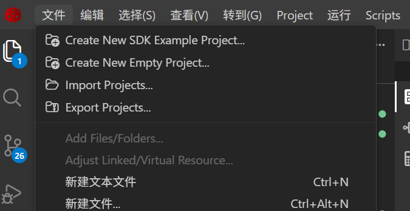
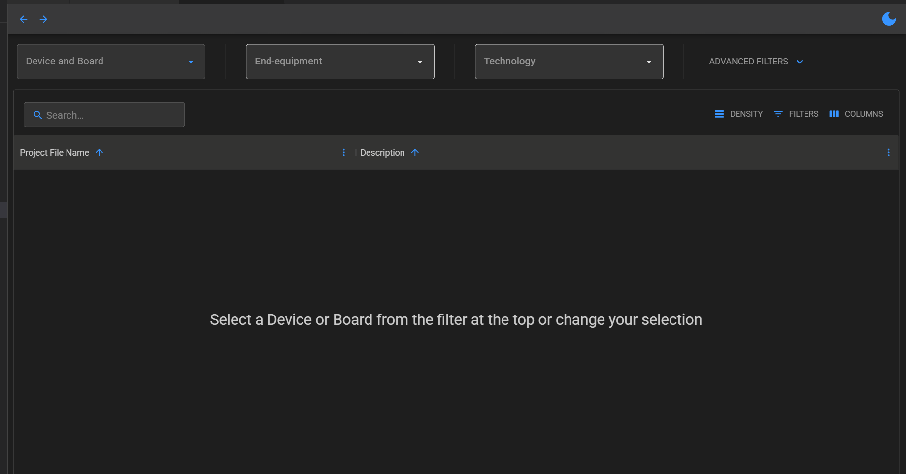
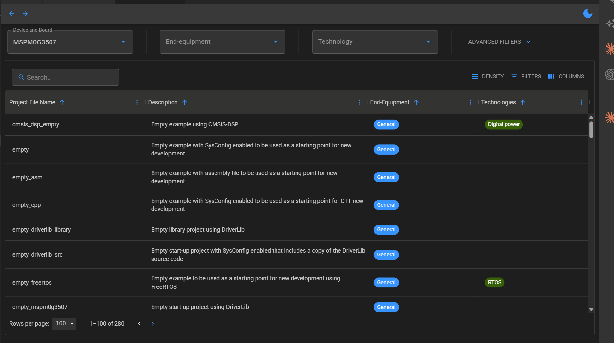
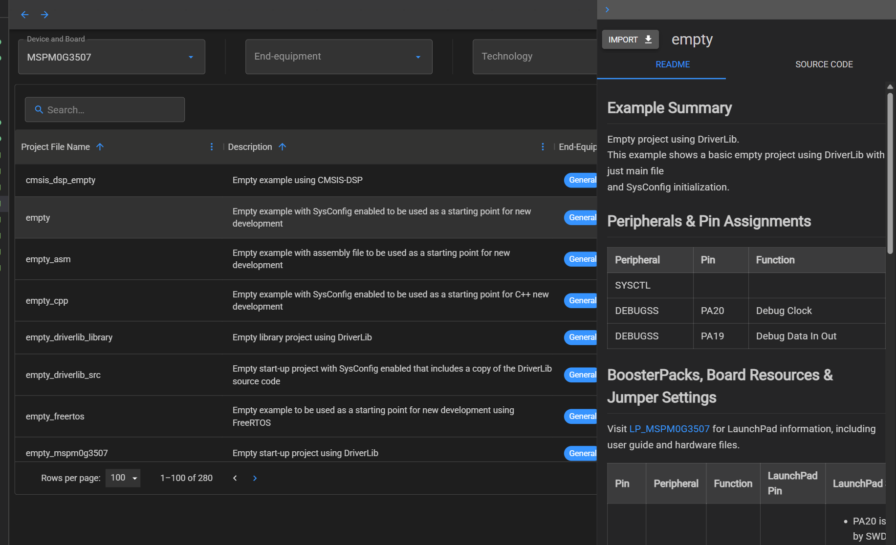
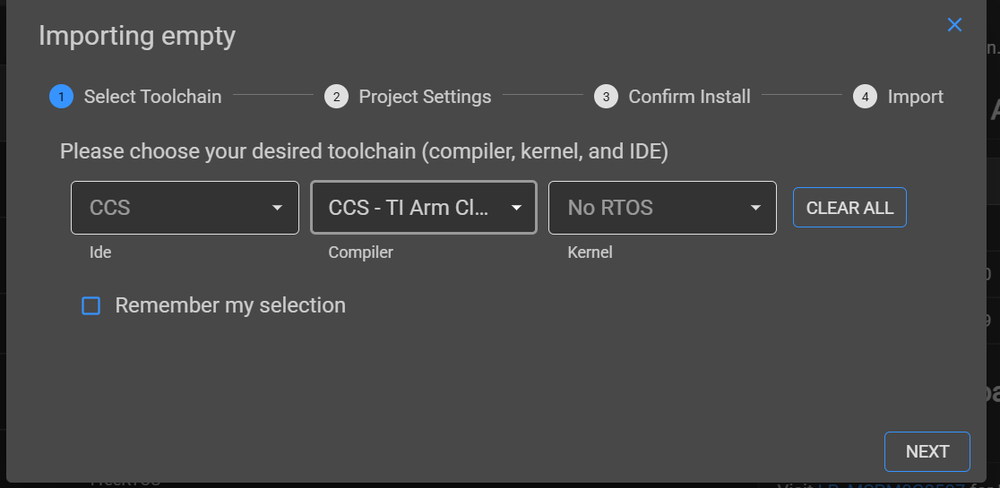
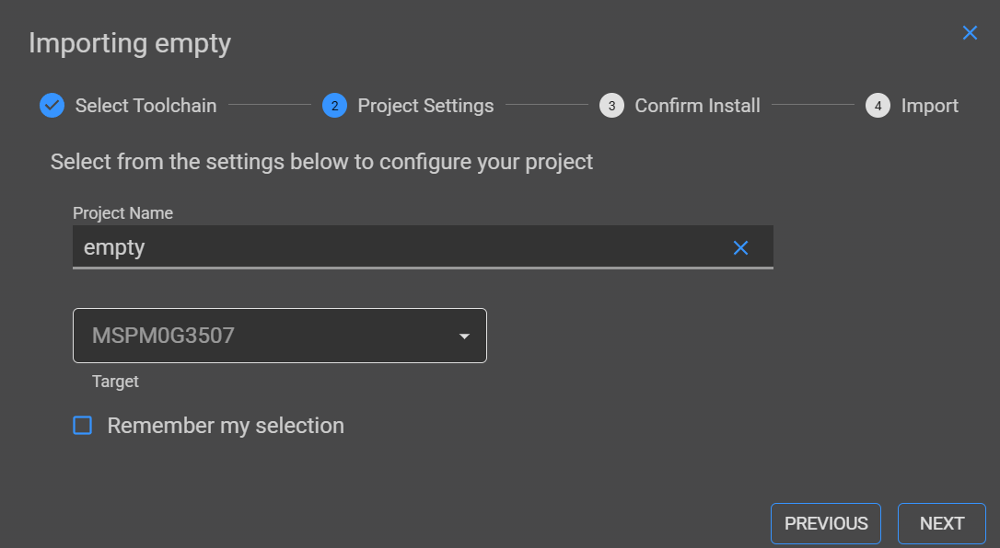
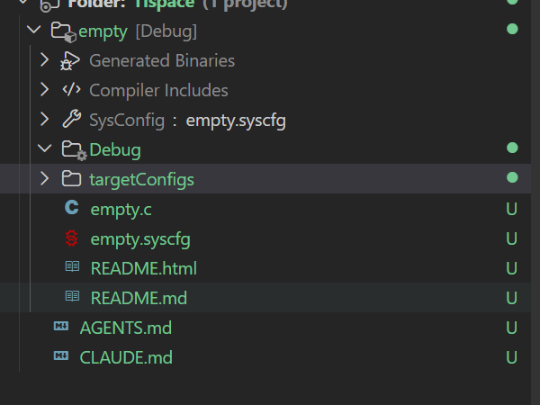

# 

# CCS环境配置
有两种方案（只介绍简单的方案一）：

1. 官网下载ccs：
    ccs下载链接：https://www.ti.com/tool/ccs

2. 第二步
    下载好ccs之后进入ccs

    顶栏选项中选择 “文件（file）”

    选择  “创建新的sdk历程项目（create new sdk example project）”

    进入历程选择界面

3. 创建sdk历程

    在drivers and board里面搜索3507，然后选择drivers下面的MSPM0G3507

    
    

4. 下载sdk历程

    选择empty，然后点击import下载该空历程

5. 配置历程

    这里选择编译器 GCC-TI ARM Clang Compiler

    
    
    项目命名，最好不要含中文

    
    
    
    第三步选择要下载的文件，初次配置会下载三个文件，其中一个就是sdk库，后面下载就不需要了

                    **（我没截图，下载过一遍之后会自动跳过该过程）**

6. 配置完成

    方案一就是通过官方提供的sdk空历程，实现sdk库的链接和环境的配置

    方案二是通过自己创建一个空白项目，然后手动在官网下载sdk库，最后链接到项目中，费时费力，这里不介绍了

    以后创建新的项目，都可以通过下载空历程的方式完成，能省去每次都重新配置的麻烦

# 程序书写

通过空历程创建好项目之后，项目文件格式就如图所示

能见文件很少，大部分配置脚本自动生成之后隐藏掉了

 

empty.c就是我们程序书写的主文件

和那个stm32cubemx生成好代码之后其实差不多，自由度更高

 

empty.confrg文件就是图形化配置界面的文件，双击打开，在里面初始化配置芯片

