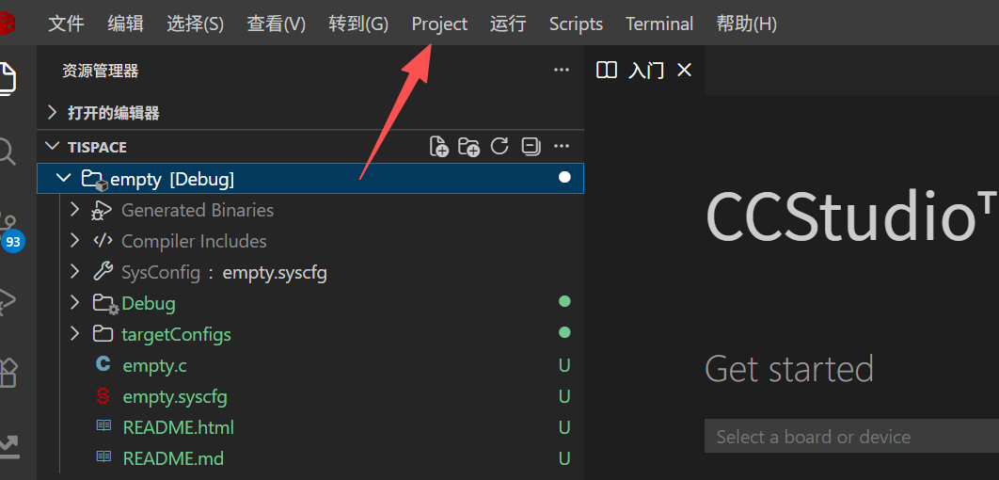
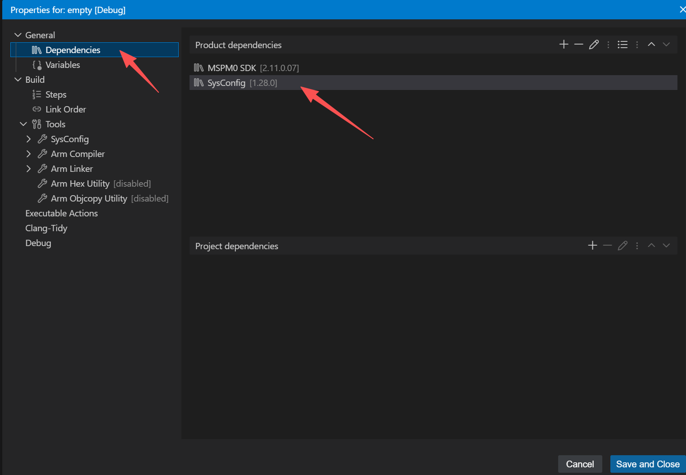
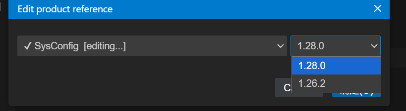
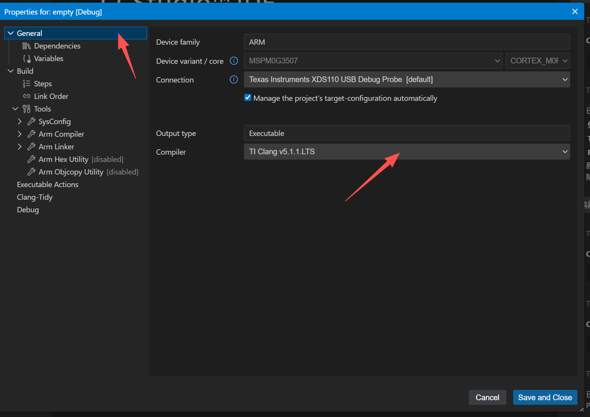
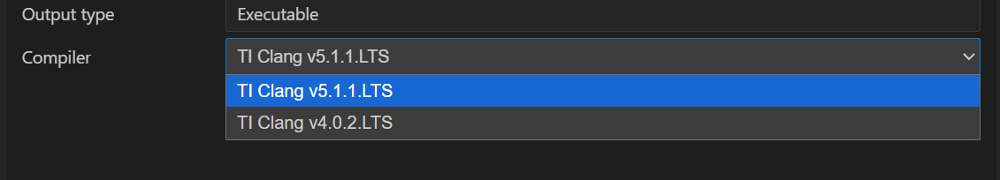
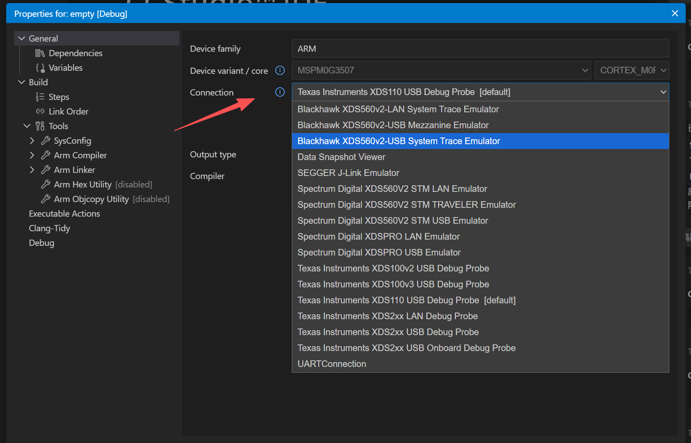

#

# 改中文

**shift+ctrl+p** 
打开命令面板，输入dis，就能看到配置语言

点击之后等待一会，选择中文即可，如下图

# 更改SYSCONFIG版本

因为下载的空历程不是实时更新的

所以有时候下载的空历程是用的老版本的SYSCONFIG

如何切换：

1. 选中项目

2. 点开 project

3. 点开properties

4. 左侧栏通用下面选择dependencies

    点击sysconfig

5. 选择版本

6. 切换完成之后重新打开sysconfig

# 编译链工具版本切换（烧录器选择）

1. 打开配置前和sysconfig切换一致

2. 在general下选择工具链版本

3. 烧录器的切换在上面一行

